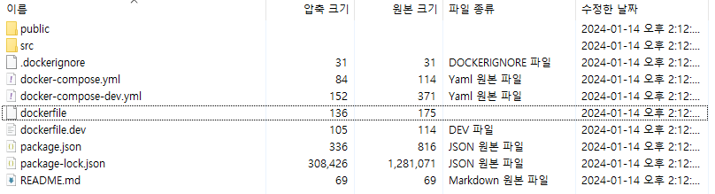

# 일단 두서없이 생각 나는대로 정리

- Github Action은 내가 직접 CI/CD 툴 서버를 관리하는 것이 아니다 보니 정확한 동작 방식은 알 수 없지만 아마 동일할 것으로 보인다.

- Github Action은 Runner라는 이름으로 컴퓨팅 리소스를 제공한다고 한다.

- 그럼 그 Runner가 deploy.yml에 명시된 내용에 따라 도커 컴포즈 파일, 도커 파일에 명시된 내용을 수행하고 배포까지 수행하는 것이다.

- `zip -r deploy.zip . -x '*.git*'` github action runner의 내부를 알 수는 없지만 아마 이부분이 Runner 내부에 빌드된 아티팩트가 있는 경로에 압축 명령을 내리는 것이 아닐까

- 기본적으로 제공되는 Runner가 있고 이것을 사용하면 Jenkins를 사용할 때 처럼 직접 서버를 구축하는 수고가 사라진다.

- https://hyperconnect.github.io/2021/11/08/github-actions-for-everyone-1.html

- Self-Hosted Runner도 있는데 이건 구축한 클라우드 리소스에 Actions Runner를 설치해서 사용하는 것이다. 그렇더라도 Jenkins를 사용해서 자바 스프링 App을 빌드할 때 Jenkins 서버에 빌드가 가능한 환경을 추가로 구축해줘야 하는 수고보다 덜한 것 같다.

- https://tech.kakao.com/2022/05/06/github-actions/

- 이번에 구축한 CI/CD의 동작방식을 다시 살펴보면 Runner가 모든 명령을 수행하는데 Runner가 가진 AWS EB에 대한 배포 프로세스가 있고 그 프로세스가 EB 환경 정보와 EB와 연계된 S3 버킷의 이름을 명시하는 것 만으로도 직접 Jenkins를 통해 아티팩트를 업로드하고 배포하듯이 진행하는 것이다.

- 추가로 Runner가 레포지토리를 복사하는 동작 과정에 대한 내용 https://www.daleseo.com/github-actions-checkout/

- 자세한 Github Action EB 배포는 https://github.com/einaregilsson/beanstalk-deploy/blob/master/beanstalk-deploy.js

- 같은 레포에 action.yml에 AWS EB 배포에 필요한 파라미터?들도 확인할 수 있다.

- 근데 여기서 도커 컨테이너를 어떻게 알아서 실행하는 걸까? 도커 컨테이너 실행에 대한 명령어는 전혀 없는데

- Runner는 레포지토리를 복사해오고 명령이 내려졌으니 도커 빌드를 하고 빌드, 테스트를 진행한다고 치면 EB는 어떻게?? 명시된게 없는데

- 그리고 아티팩트를 다시 열어봤는데

- 

- 아! 내가 EB 구성 자체를 컨테이너 구성으로 생성했구나! ^^

- 그럼 Github Action은 레포지토리를 CI하고 빌드하고 테스트하고 그다음 CI된걸 그대로 EB에 넘기고 EB는 또 docker-compose.yml에 명시된대로 작성한 도커 파일 따라서 React App 빌드하고~ 빌드된것만 Nginx 컨테이너 홈 디렉토리에 전달하고 그 컨테이너 실행하고 포트 맵핑하고 그런거였구나.....

- React App 빌드한 이미지, 컨테이너는 삭제되고 마지막 배포된 Nginx 컨테이너만 남고 실행되면서 CD가 끝나는 거였구나.......

- 그래서 서버 안에 컨테이너랑 이미지가 하나밖에 없었구나... 그랬구나...

- 아닌가? 더 명확하게는 저게 두개의 이미지 빌드하고 그런게 아니라 한 과정 전체를 단계를 나눠서 빌드 단계, 배포 단계를 나누는데 실행되는 컨테이너는 명시한대로 Nginx 베이스이미지에 빌드한 아티팩트만 넘겨주는 그런 컨테이너인가?

- 아니 이런 헷갈림이 생기는 이유는 도커 컨테이너 안에 들어갔는데 아무리 찾아도 저 /usr/src/app 디렉토리가 없는데 빌드 과정이 어떻게 된거고 실행되는 컨테이너는 어떤 건지 알 수가 없어서다...

- 원래 WORKDIR 명시하면 그 부분으로 바로 접근이 되어야 하는데 되지 않는 것으로 봐서 Dockerfile이 멀티 스테이지로 이루어져 있고(builder로 선언한 부분과 그렇지 않은 부분) 위에 말한 것에서 조금 수정해서 EB에 복사된 레포지토리 기준으로 도커 컴포즈 파일 실행 -> 도커 파일 실행 -> 빌드 스테이지에서 WORKDIR에 소스 코드 복사 -> 패키지 설치 및 빌드 -> 빌드된 아티팩트 COPY 하면서 Nginx 이미지 기반 컨테이너 이미지 생성(여기까지 도커 파일) -> 도커 컴포즈가 포트 맵핑하면서 그 이미지 기반 컨테이너 실행 -> 배포 끝

## Github Action

### Workflow

- 자동화된 전체 프로세스로 하나 이상의 Job 으로 구성되며 Event 에 의해 트리거 되거나 예약될 수 있다. 배포를 포함하여 테스트, infra 구성등 모두 하나로 보는 개념이다. Jenkins 의 Pipeline 과 비슷한 개념이다.

### Event

- Workflow 를 트리거하는 특정한 활동이나 규칙이다. 보통 master, main, release 브랜치에 트리거 규칙을 정해놓곤 한다. 즉, master 브랜치의 코드 변경사항이 있다면 Workflow 를 발동시킨다.

### Job

- 단일 가상 환경에서 실행되는 작업들의 단위이다. 여러 Job과 의존 관계를 맺을 수 있으며 독립, 병렬로 실행될 수 있다.

### Step

- Job 안에서 순차적으로 실행되는 프로세스 단위이다.

### Action

- job 을 구성하기 위한 step 의 조합이다. Github Actions Market Place 에 많은 Actions 가 정의되어 있어서 쉽게 가져다 사용할 수 있다.

```yaml
name: Deploy to Amazon ECS

on:
  push:
    branches: ["main"]

env:
  AWS_REGION: MY_AWS_REGION # set this to your preferred AWS region, e.g. us-west-1
  ECR_REPOSITORY: MY_ECR_REPOSITORY # set this to your Amazon ECR repository name
  ECS_SERVICE: MY_ECS_SERVICE # set this to your Amazon ECS service name
  ECS_CLUSTER: MY_ECS_CLUSTER # set this to your Amazon ECS cluster name
  ECS_TASK_DEFINITION:
    MY_ECS_TASK_DEFINITION # set this to the path to your Amazon ECS task definition
    # file, e.g. .aws/task-definition.json
  CONTAINER_NAME:
    MY_CONTAINER_NAME # set this to the name of the container in the
    # containerDefinitions section of your task definition

permissions:
  contents: read

jobs:
  deploy:
    name: Deploy
    runs-on: ubuntu-latest
    environment: production

    steps:
      - name: Checkout
        uses: actions/checkout@v3

      - name: Configure AWS credentials
        uses: aws-actions/configure-aws-credentials@v1
        with:
          aws-access-key-id: ${{ secrets.AWS_ACCESS_KEY_ID }}
          aws-secret-access-key: ${{ secrets.AWS_SECRET_ACCESS_KEY }}
          aws-region: ${{ env.AWS_REGION }}

      - name: Login to Amazon ECR
        id: login-ecr
        uses: aws-actions/amazon-ecr-login@v1

      - name: Build, tag, and push image to Amazon ECR
        id: build-image
        env:
          ECR_REGISTRY: ${{ steps.login-ecr.outputs.registry }}
          IMAGE_TAG: ${{ github.sha }}
        run: |
          # Build a docker container and
          # push it to ECR so that it can
          # be deployed to ECS.
          docker build -t $ECR_REGISTRY/$ECR_REPOSITORY:$IMAGE_TAG .
          docker push $ECR_REGISTRY/$ECR_REPOSITORY:$IMAGE_TAG
          echo "image=$ECR_REGISTRY/$ECR_REPOSITORY:$IMAGE_TAG" >> $GITHUB_OUTPUT

      - name: Fill in the new image ID in the Amazon ECS task definition
        id: task-def
        uses: aws-actions/amazon-ecs-render-task-definition@v1
        with:
          task-definition: ${{ env.ECS_TASK_DEFINITION }}
          container-name: ${{ env.CONTAINER_NAME }}
          image: ${{ steps.build-image.outputs.image }}

      - name: Deploy Amazon ECS task definition
        uses: aws-actions/amazon-ecs-deploy-task-definition@v1
        with:
          task-definition: ${{ steps.task-def.outputs.task-definition }}
          service: ${{ env.ECS_SERVICE }}
          cluster: ${{ env.ECS_CLUSTER }}
          wait-for-service-stability: true
```

- 위와 같이 미리 생성된 스크립트를 리팩토링해서 사용할 수 있다.
